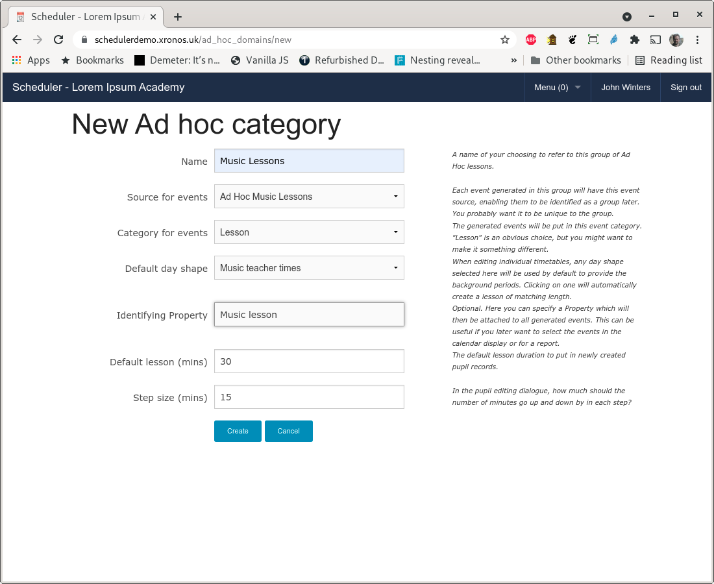
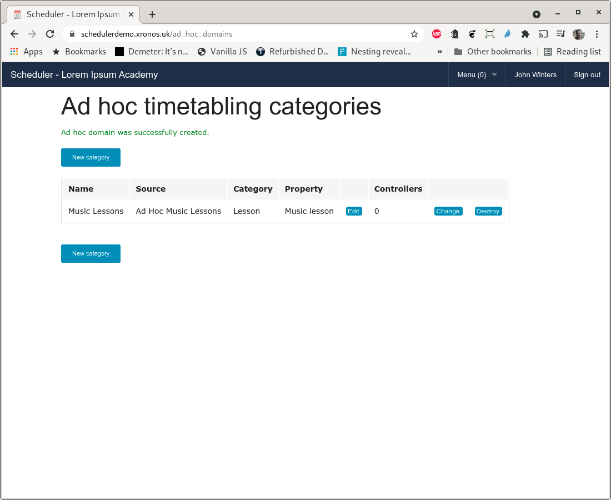
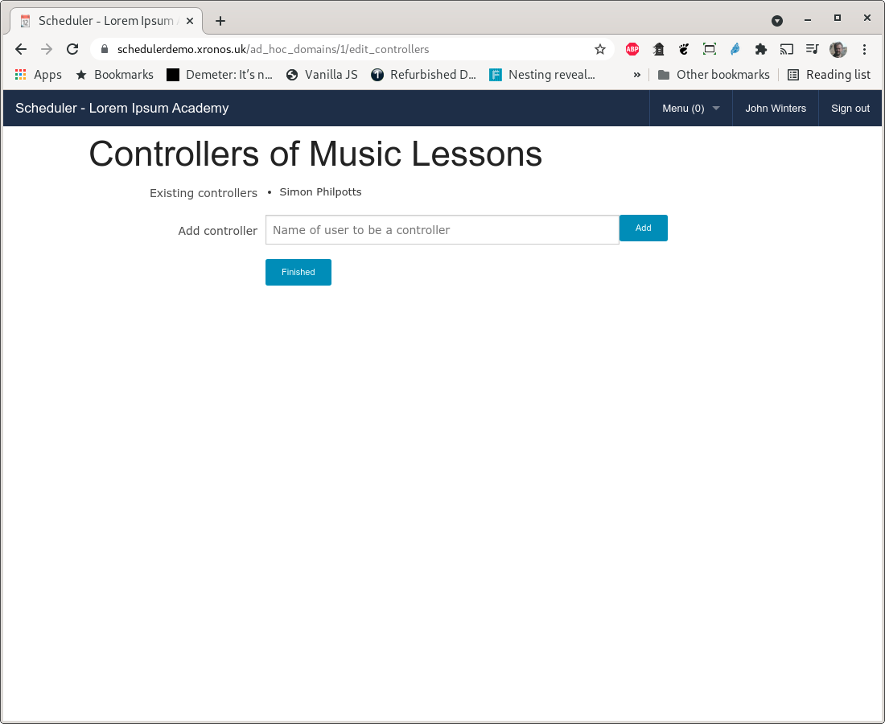

.. _adhoc:

Ad Hoc Lessons
==============

Purpose
-------

Scheduler uses the term "Ad Hoc Lessons" to refer to lessons where pupils
are taken out of their normal timetabled lesson for some kind of extra
tuition.  Typically this will be an instrumental music lesson, learning
support or something similar.

It is generally desirable to rotate these kinds of lessons so pupils
don't miss the same subject more often than is necessary.  If, for instance,
an instrumental music lesson makes a pupil miss a maths lesson one week,
then the same pupil should not miss another maths lesson the following
week.

The person responsible for scheduling these Ad Hoc lessons therefore
needs access to all the pupils' individual timetables, plus a record
of what lessons they have already missed.  Scheduler aims to assist with
this by providing all the relevant information in one place.

Once a suitable schedule for the term (or half term, or whatever period
you choose) has been devised it can be published automatically to both
pupils and relevant teachers.

Configuration
-------------

It is up to the system administrator to define categories of Ad Hoc Lessons
and appoint controllers for each category.  Once this is done, the rest
of the scheduling work can be done by those controllers.

Each category needs:

* A name - for instance, "Music lessons".
* An event source - to identify all its lessons.
* An event category in which to place its events - typically "Ad Hoc Lesson".
* A default day shape to define when lessons might occur.
* An identifying Property - to allow users to select such lessons to view.

The system administrator also needs to define (because they are global
items within the system):

* The day shape to be used by the Ad Hoc category.
* Any Subject records - e.g. Violin, Viola, Mandolin, etc.

Start by creating a Day Shape (Menu => Admin => Day shape) if required.
Typically each teacher of this sort of lesson will have a different
availability (e.g. Monday all day plus Tuesday mornings) but if you
have an overall shape to the day (e.g. Mondays are from 09:00 to 12:30
and afternoons are from 14:00 to 16:00) then you can create a corresponding
Day Shape which will then assist the controller of the Ad Hoc category in
setting up individual availability records for each teacher.

Create an Event Source using Menu => Admin => Models => Events => Sources

Create an Event Category using Menu => Admin => Models => Events => Categories.
It is important that Ad Hoc Lessons have their own category because they
want slightly different flags from ordinary lessons.  When the nightly
job runs to create lists of pupils who will be missing lessons, we want it
to flag pupils who are missing ordinary lessons for Ad Hoc lessons, but
not generally the other way around.  The whole point of Ad Hoc lessons is
that they override the normal lessons.

Create a new Property using Menu => Admin => Models => Properties

You can then create your new Ad Hoc category using Menu => Admin => Ad Hoc t/ts
and then click on "New category" which will give you a screen like this:

Note that this form has been filled in using the records referenced previously.
You can also specify the normal length of a lesson, plus how much it might
be adjusted by.  For this example, the normal length of a lesson is 30 minutes,
but it might be desired to create one of 45 or even 60 minutes, so the step
size has been set to 15 minutes.

Hit the "Create" button and you will be returned to the listing of Ad Hoc
categories showing your newly created one.

Appoint at least one Controller for the category by clicking the "Change"
button.

In this case, the ubiquitous Simon Philpotts is taking on the rôle again.

You have now set up the Ad Hoc category and the rest of the work can be
done by the Controller(s).  Documentation for them will be found in
the `Scheduler Advanced User Guide <https://xronos.uk/advanced/adhoc.html>`_
