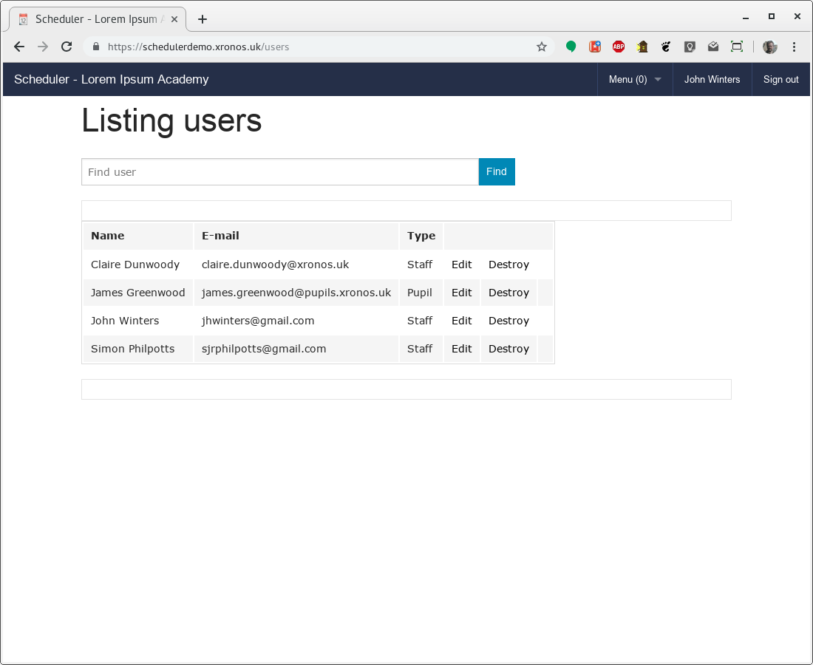
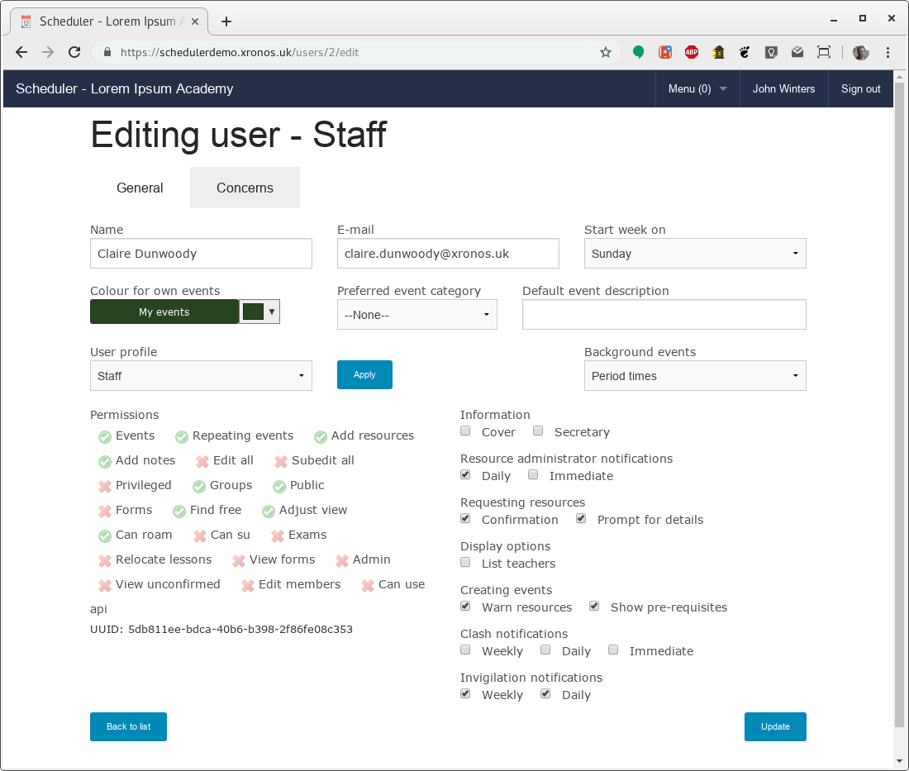
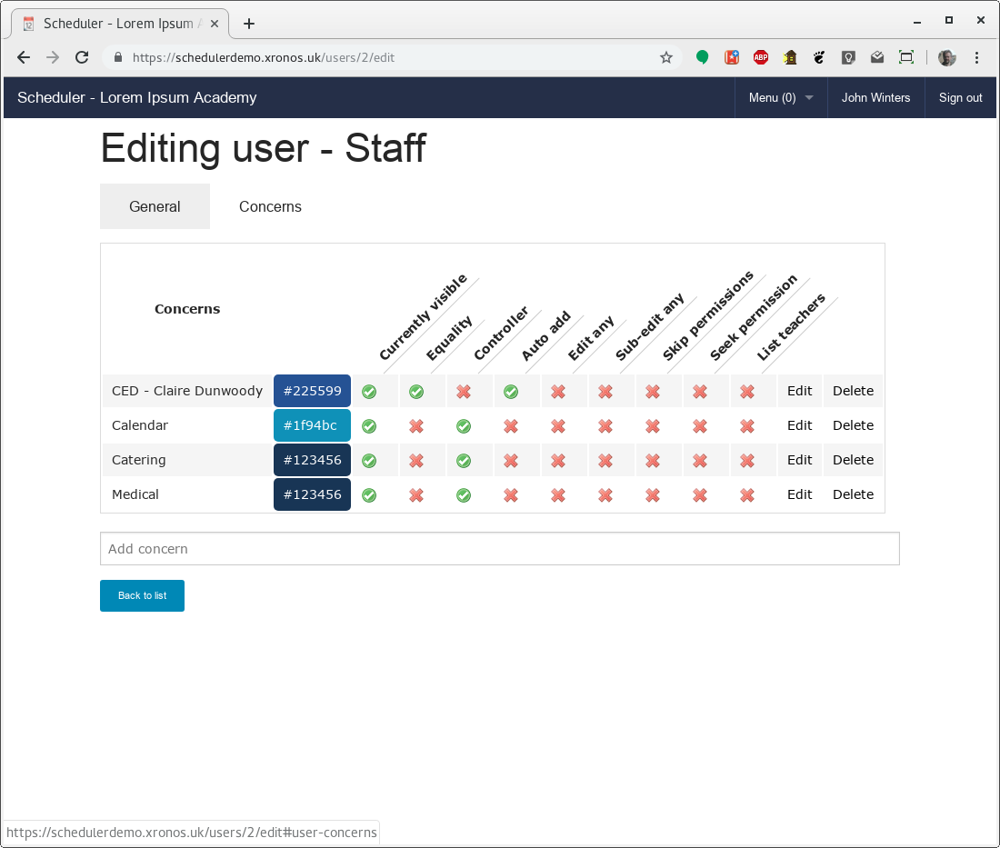
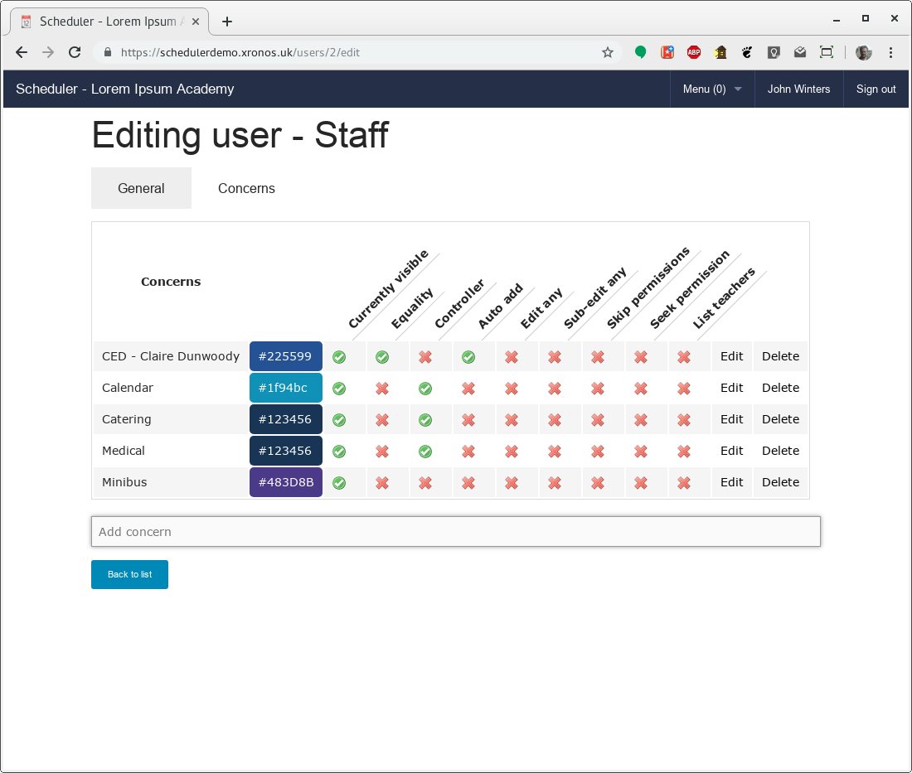
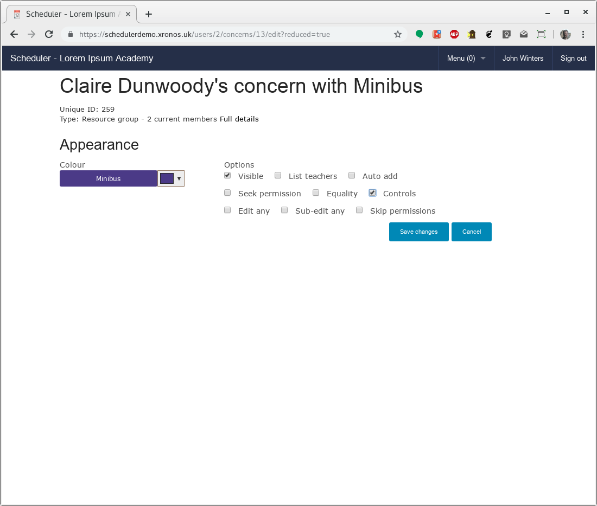

.. _controls:

Controlling resources
=====================

Concepts
--------

The working of Scheduler revolves around the concept of resources
attached to events.  The whole package exists simply to record when
any individual resource is busy and when it is free.

These resources, can be people, places, or abstract things like
services or properties.

In a typical school, many resources are available on a first come, first
served basis.  The first teacher to schedule an event in a given classroom
gets it, and then to anyone coming along later it is busy.  No authorization
is needed.

For other resources though, a degree of control is needed.  Resources
which need control could be things like:

- The theatre
- The main public calendar
- The sport calendar
- The sports hall
- Audio-visual support
- Catering
- Cleaning

or anything else which the system administrator chooses.

The theatre may well have an administrator who handles bookings and
schedules resources around those bookings.

The main public calendar will certainly have at least one person
controlling it - people submit proposed events and then the controller
decides which ones can actually appear in the calendar.  Likewise
for the sport calendar, although it may well have a different
controller.

Audio-visual support may be provided by a particular individual.  He
or she will need to look at requests and decided which ones can be
fulfilled.

Catering and cleaning are potentially much more complex.  They will
probably need associated forms (also provided within Scheduler) and
perhaps account codes for the service to be charged to.

Some things can cope with only one booking at a time - the theatre
for instance - whilst others may be able to cope with several - e.g.
catering.  It's up to the resource administrator to decide what
is feasible.

There exist also pooled resources - those where the requirement
is for one (or more) resources from the pool, but it doesn't actually
matter to the requester which one is allocated - e.g. minibuses
Scheduler handles this case through the use of Resource Groups.

Adding control
--------------

The default for any resource in Scheduler is that it is freely
assignable to events.  Anyone with edit permission can add any resource
to any event which they can edit.

To put a resource under control, one simply needs to allocate one
or more controllers to it.  This is done by way of the User editing
dialogues.

Menu => Admin => Models => Users

Clicking "Edit" for the user Claire Dunwoody produces the following:

Notice that there are two tabs here, labelled "General" and "Concerns".
Click on the "Concerns" tab to see the existing links between
CED and resources within the system.

CED is currently linked to four resources within the system.

- Herself
- The public calendar
- Catering
- Medical

Those last two are Services within the demonstration system.

All of them are currently visible - that is, events involving them
will appear on her default Scheduler display.

For three of them though she is also listed as being a "Controller".
This has two effects:

- The corresponding resource is controlled, meaning that it can't
  just be added to an event by other users - it goes through the
  permissions process
- CED can grant permission for such requests

Let's say we want to make CED a controller of minibuses too.
First she needs a Concern linking her user record to the Minibus
resource group.  She could add this herself on the main screen,
but the system administrator can add it here too.

Just type "Minibus" in the "Add concern" box below the Concerns
listing - the usual predictive text will appear.  Select the
required item and press Enter.

CED then has an extra Concern, like this:

Click on the "Edit" link for the Minibus concern, and tick the
"Controls" check box.

Then click "Save changes" to put your change into effect.

CED is now a controller for the "Minibus" resource, and requests for
a minibus will come to her.

Default resources
-----------------

A number of default Properties are created when a new Scheduler
system is installed.  These are expected to exist for the proper
running of the system.

Several of these almost certainly need to be given controllers before
your system goes live.  Specifically:

- Calendar
- Suspension
- Gap

The "Calendar" property is for events which you want to appear in
your public calendar - events which are to be visible to users
who have not logged in to your system.  This should be under the
control of the person who decides what goes in your public calendar.

.. note::

  Although there is just one "Calendar" in a new system, you can create
  as many public calendars as you like, and you can rename the original one.
  Just create a Property and tick the "Public" check-box for it.

  If you have more than one public calendar in your system, Scheduler
  lets guests choose which ones they will see.

The Suspension and Gap properties are used to massage the timetable
as it is imported from your MIS.  For full details see the
documentation on
:ref:`gaps`

Again, you don't want ordinary users to be able to allocate these
properties to their events, so give them a controller.

