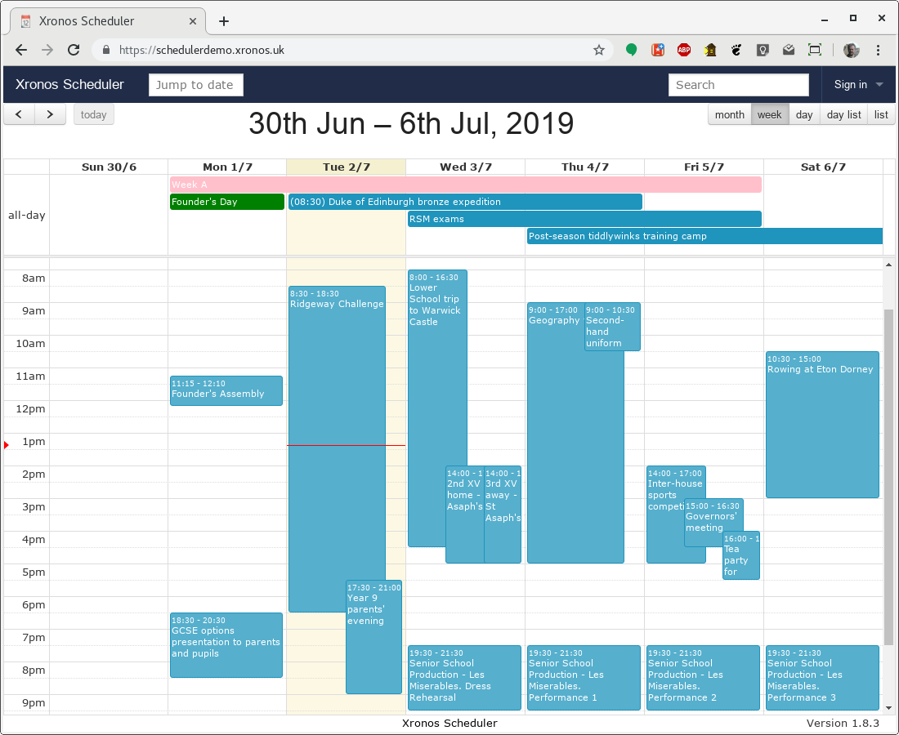

.. Xronos Scheduler documentation master file, created by
   sphinx-quickstart on Thu Nov 17 11:45:33 2016.
   You can adapt this file completely to your liking, but it should at least
   contain the root `toctree` directive.

Index
=====

Xronos Scheduler - Admin Guide

This guide is intended for those responsible for administering an
installation of Xronos Scheduler.  It contains sections dedicated
to various tasks.

It is currently very incomplete - expect a lot of extra sections to
appear.

Download this guide as a
`PDF <https://xronos.uk/pdfs/SchedulerAdminGuide.pdf>`_

.. toctree::

   endofyear
   contact

Other documents
---------------

- `Scheduler User Guide <https://xronos.uk/>`_
- `Scheduler Advanced User Guide <https://xronos.uk/advanced/>`_
- `Scheduler Installation Guide <https://xronos.uk/install/>`_

Scheduler is licensed under the GNU General Public Licence, version 2.

Note - Scheduler is *not* a timetabling program.  It has no facilities
at all to solve the problem of school timetabling.  If you want a good
timetabling program, try `Keith Johnson's Timetabler <http://www.timetabler.com>`_.

Indices and tables
==================

* :ref:`search`

